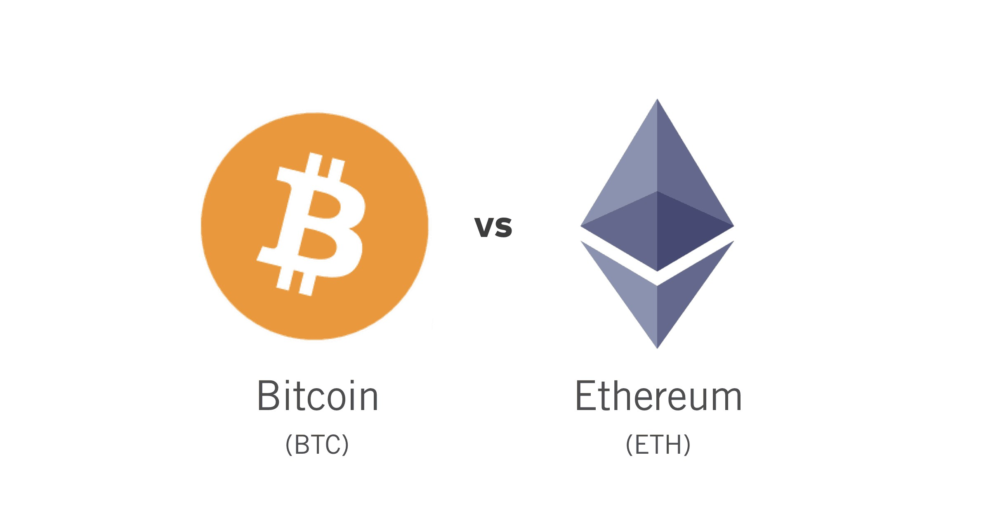
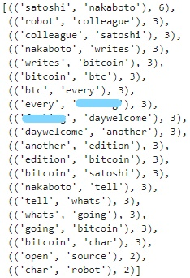

# Cryptocurrency Sentiment Analysis

This activity compares two crypto-giants, Bitcoin and Ethereum, across various natural language processing tools. First comparison consisted of a sentiment analysis for each coin's most recent news articles, and used the results for a statistical analysis of the sentiment scores. After, these two non-fiat currencies were compared through a frequency analysis of their top ten bigrams and single word tokens. This process required creating various functions that depended on NLTK and Pandas library. Later, the tokens previously generated were used to run a WordCloud to visualize their overall most common used words among their articles. Lastly, all the articles for each coin were placed into two large corporas, btc_corpus and eth_corpus. The corporas were then processed through a named entity recognition model, spaCy, and a visual software library, displaCy, to tag and label important words within each corpus.

## Sentiment Analysis

### Bitcoin Sentiment Analysis

### Ethereum Sentiment Analysis

### Summary

## Frequency Analysis

### Bitcoin 

### Ethereum

## WordCloud

## Name Entity Recognition

